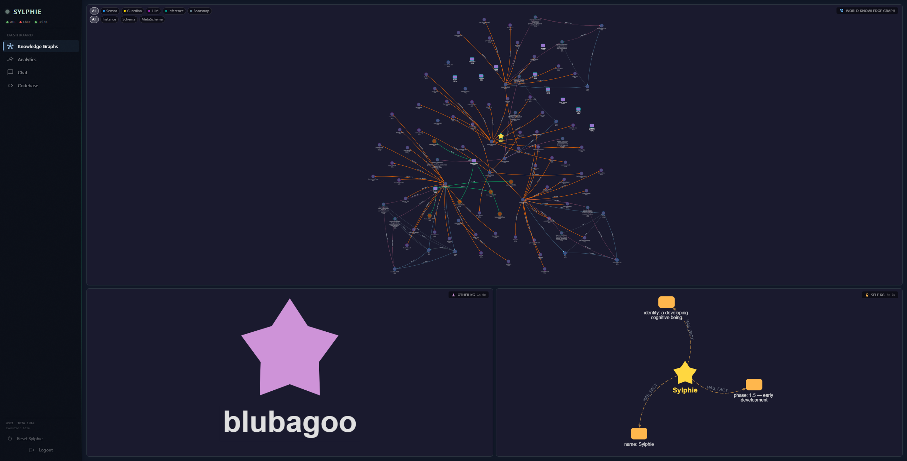
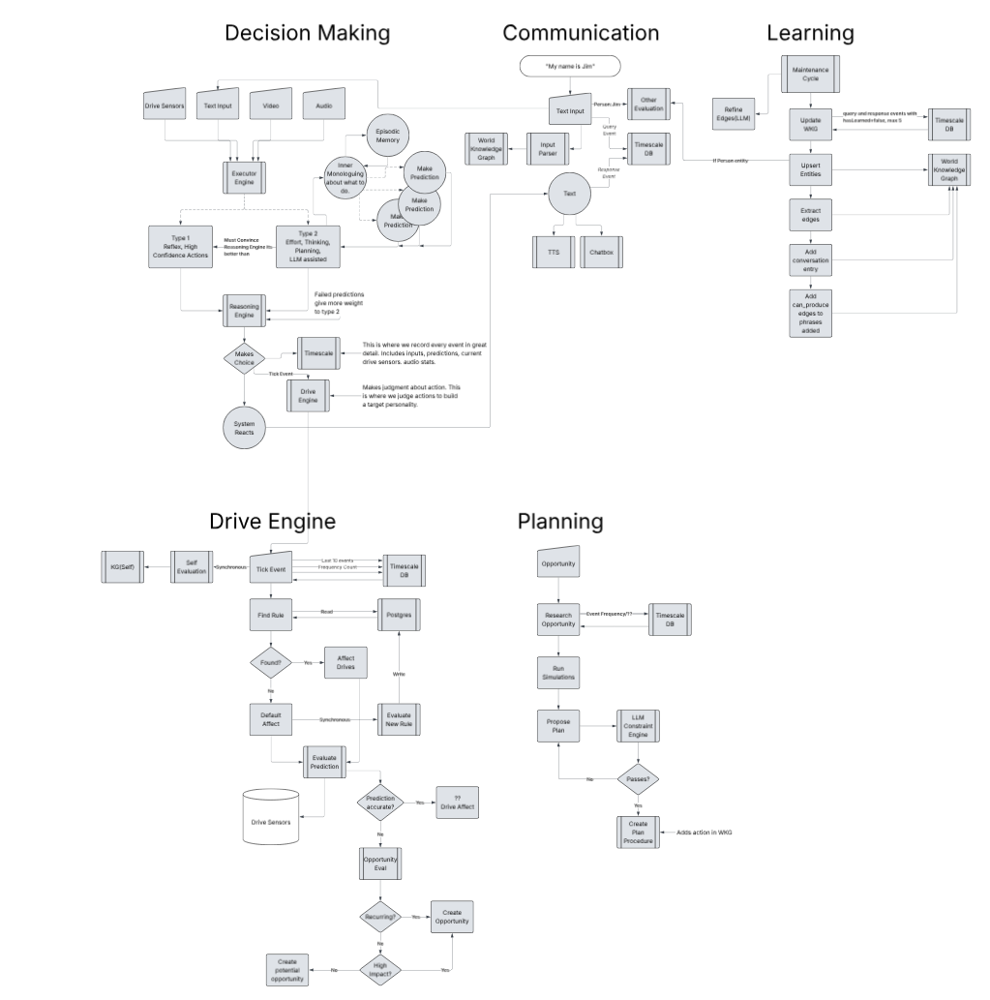
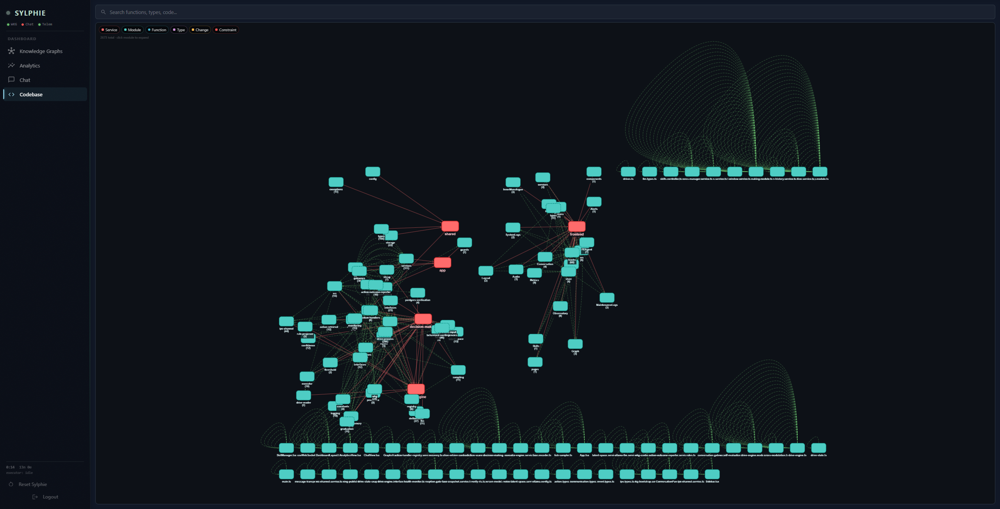

# Sylphie: Post-Rewrite Retro

**Date:** 2026-04-29
**Author:** drawn from a full source-code dive (no markdown was read; every claim is grounded in code at a specific path)
**Companion files:** `sylphie-architecture-notes.txt`, `sylphie-stub-inventory.md`

---

## TL;DR

The rewrite landed. The codebase as it sits today — eight packages, four Neo4j instances, two Python sidecars, drive engine as a separate process, NestJS main + React frontend on a single Railway port — is the result, not a precursor. This document is a retro on it: what the rewrite set out to do, what shipped, what's stubbed in the place it would actually be load-bearing, and where the work should go next.

The clean five-box diagram in `wiki/sylphie2.png` is still the architectural North Star. The rewrite preserved it. The work that remains is not another rewrite — it's finishing the substrate physics inside the boxes the rewrite added.

---

## 1. Origins: one window, one star



Sylphie started as a single screen with a knowledge graph and a chat box. The bottom-right widget shows the seed of the Self KG — three Attributes hanging off one CoBeing node: `name=Sylphie`, `identity=a developing cognitive being`, `phase=1.5 — early development`. Those exact strings still appear today in `WkgBootstrapService.bootstrap()` at `apps/sylphie/src/services/wkg-bootstrap.service.ts`. Everything that came afterward built outward from that anchor.

The bottom-left "blubagoo" panel was the placeholder for the speech surface — what would eventually become `CommunicationService` (1166 lines today) routing through ElevenLabs TTS, Deepgram STT, ConversationGateway, and the answered/unanswered conversation history split.

This was the system you could hold in your head. It is no longer that system, but the anchor it grew from is intact.

---

## 2. The diagram the rewrite preserved



`wiki/sylphie2.png` is the architectural North Star. Five subsystem boxes, each with a single promise:

| Box | Promise | Where it lives now |
|---|---|---|
| **Decision Making** | Receive sensory frame → retrieve action → predict effects → arbitrate Type 1 / Type 2 / SHRUG → execute → evaluate | `packages/decision-making/` (Cortex) |
| **Communication** | LLM-mediated input parsing, response generation, voice in / voice out, person modeling | `packages/decision-making/` + `apps/sylphie/src/services/communication.service.ts` (split) |
| **Learning** | Pull unlearned events from the bus → upsert entities → refine edges → detect contradictions → decay confidence | `packages/learning/` |
| **Drive Engine** | Tick the 12 drives at 1Hz → apply rules + cross-modulation + behavioral contingencies → publish snapshots → detect opportunities | `packages/drive-engine/` + `apps/drive-server/` (separate process) |
| **Planning** | Receive opportunities → research → simulate → propose plan → validate constraints → write `:ActionProcedure` | `packages/planning/` |

The diagram has the shape of a cybernetic loop. Each box has well-defined inputs and outputs. The arrows form a closed cycle: drives create pressure → decision making acts → outcomes flow back to drives → unmet drives become opportunities → planning creates new procedures → decision making retrieves them.

The first thing to say about the rewrite is what it **didn't** change: every box on the diagram still maps to a package in the repo. The boundaries held. Whatever else this retro covers, the design intent survived intact.

What the diagram does **not** show, and what the rewrite added underneath:

- A learnable cognitive substrate (TF cognition sidecar) sitting alongside Decision Making's LLM deliberation.
- A meta-evaluator (DeepSeek supervisor) sampling cycles for quality control.
- A perception sidecar (Python: YOLO + MediaPipe + Moondream2 VLM + EfficientNet embeddings).
- A codebase-as-graph (PKG, fourth Neo4j instance) so Sylphie — and Claude Code — can read the source through the same substrate Sylphie uses to reason about the world.
- Multimodal fusion: five modality encoders (text, drive, video, audio, face, scene), each 768-dim, deterministic via Mulberry32 seeds, fused via a Xavier projection.

These are real additions. The diagram is silent on them not because they don't exist, but because they sit *inside* boxes the diagram already had names for.

---

## 3. What the rewrite shipped



**Eight packages** in the yarn workspace:

```
apps/sylphie/                — NestJS main backend, 21 services, 7 WS gateways, 12 controllers
apps/drive-server/           — standalone Node process, ~180 lines of bootstrap
packages/shared/             — DI substrate, all DB drivers, type contracts (~70 EventTypes,
                               12 DriveNames, 8 ProvenanceTypes)
packages/decision-making/    — Cortex: arbitration, deliberation, episodic memory,
                               tick sampler, sensory pipeline, latent space, working memory,
                               attractor monitor, tensor inference adapter
packages/drive-engine/       — 12-drive substrate, rule engine, cross-modulation, opportunity
                               detector, RLS-verified Postgres rules, IPC channel
packages/learning/           — consolidation timers (60s/5min/30min/10min), entity extraction,
                               edge refinement (heuristic + LLM), reflection, synthesis,
                               confidence decay
packages/planning/           — opportunity queue, research (TimescaleDB), simulation,
                               proposal (LLM + template fallback), constraint validation,
                               procedure creation, plan evaluation
packages/perception-service/ — Python FastAPI (port 8430): YOLOv8-seg + IoU tracker +
                               MediaPipe face mesh + Moondream2 VLM + EfficientNet-B0 embeddings
packages/cognition-service/  — Python FastAPI (port 8431): TensorFlow + NumPy.
                               GlobalModel + 4 PanelModels + ConvergenceModel +
                               3 DeliberationPipelines (~2.22M params total; TF-only)
packages/supervisor/         — DeepSeek meta-evaluator, sampling policy, cost tracker,
                               sidecar control bridge (5 of 6 intervention types wired)
packages/sylphie-pkg/        — codebase-as-graph indexer + 7 MCP tools for Claude Code
```

**Five databases:**

- Neo4j WKG (port 7687) — world facts
- Neo4j SKG (port 7690) — Sylphie's self-model
- Neo4j OKG (port 7689) — person models per User.id
- Neo4j PKG (port 7691) — codebase as graph
- TimescaleDB (port 5433) — event hypertable + sensory_ticks + face_embeddings + voice_patterns + visual_object_embeddings
- Postgres (port 5434) — User auth (Prisma), drive_rules, proposed_drive_rules, drive_state_checkpoint, conversation_history, episodic_memory_checkpoint, reflected_sessions, synthesized_insight_pairs

**Eight runtime processes in development:** main NestJS, drive-server (separate Node), perception sidecar, cognition sidecar, Neo4j × 4, TimescaleDB, Postgres, SearXNG. In production the Dockerfile collapses main + frontend into a single image; drive-server is **not in the production image**. Architectural drive isolation in dev becomes RLS-only isolation in prod.

**Seven WebSocket gateways on the main app:** `/ws/conversation`, `/ws/perception`, `/ws/audio`, `/ws/graph`, `/ws/telemetry`, `/ws/supervisor`, `/ws/webrtc`.

That's the surface. The next sections are what's working underneath it and what isn't.

---

## 4. What the rewrite set out to do

Reading the architecture as it sits, the rewrite's goals are visible in what got built:

1. **Replace LLM-as-substrate with learnable-model-as-substrate.** The original cognitive cycle ran entirely through Ollama — every Type 2 deliberation was 3 candidate generations + an optional for/against debate + an arbiter, six LLM calls in the worst case at 200ms–2s each. CognitiveAwareness drive (idx 3) is wired to LLM cost pressure, so the system was almost always overwhelmed. The rewrite added a TF sidecar that takes a 1561-float input (768 fused embedding + 12 drive vector + 12 drive deltas + 1 total pressure + 768 episodic context) and outputs a 32-slot action bias. Five models (Global "Brainstem" + 4 Panels + Convergence) plus a Deliberation system of three pipelines + a Synthesis model. ~2.22M params.

2. **Add a meta-evaluator above the cycle.** DeepSeek-reasoner sampling 1-in-N cycles for quality control. Six intervention types (`reinforce`, `correct`, `freeze_model`, `unfreeze_model`, `rollback_checkpoint`, `boost_salience`). Cost-tracked daily budget (default $5/day; pricing hardcoded as $0.28/M input + $0.42/M output as of 2026-04). Slow-loop quality control sitting above the fast-loop cycle.

3. **Make drive isolation architectural, not just policy.** Drive engine moved into its own Node process (`apps/drive-server`). Single-WebSocket transport on port 3001. Single-client policy (subsequent connections rejected with code 1013). Runtime Postgres user has UPDATE/DELETE forbidden on `drive_rules`, verified by `RlsVerificationService` in rolled-back transactions at startup — startup ABORTS on failure.

4. **Add real perception.** Camera frames in via the browser → JPEG bytes to Python sidecar → YOLO detections + 478-landmark face mesh + IoU-tracked objects + 1280D EfficientNet embeddings + (lazy) Moondream2 VLM caption. VisualWorkingMemoryService stabilizes noisy tracker output (PRESENCE_WINDOW_SIZE=30, ENTER_RATIO=0.70). FaceSnapshotService maintains a two-layer face latent space (hot centroids + warm pgvector).

5. **Make Sylphie's own code legible to her.** PKG: ts-morph parses 5 watched packages into a fourth Neo4j instance with Service/Module/File/Function/Type/CodeBlock/Change/Constraint nodes and CALLS/USES_TYPE/INJECTS/EXTENDS/IMPLEMENTS/CHANGED_IN edges. Seven MCP tools expose this to Claude Code. Sylphie can read her own architecture through the same substrate she uses to reason about the world.

6. **Bootstrap progression as a graduation path.** `BootstrapTracker` defines four modes — shadow → audit (100 comparisons) → partial (one category graduated, ≥0.85 agreement, ≥20 samples) → full (≥0.90 agreement, ≥3 categories graduated). Each mode hands more decisional authority to the tensor. Confidence cap forces Type 2 in partial mode (max 0.79); panel divergence > 0.3 caps all candidates < 0.80, forcing Type 2 as a sanity check.

These are the goals the structure tells you about. By the structural test, the rewrite achieved all six.

---

## 5. What worked

**The diagram held.** Five boxes, five packages, clean boundaries. Decision Making does not directly inject Communication. Learning does not import Planning. Subsystems communicate through the TimescaleDB event hypertable, with `EVENT_BOUNDARY_MAP` as a compile-time-checked `Record<EventType, SubsystemSource>` so each event type has an owning subsystem at the type level. The diagram's loop closes at runtime because the bus is real.

**Drive isolation is architectural.** Main app cannot import the engine. Single-client WS lock. RLS verification at startup. Header docstring on drive-server: *"Sylphie cannot introspect her own drive rules, accumulation rates, or evaluation function. She only sees the resulting drive snapshots."* This is CANON Standard 6 implemented as code that refuses to start if violated. It is one of the cleaner pieces of the rewrite.

**Theater Prohibition at the type level.** All `SylphieEvent` carry mandatory `driveSnapshot`. `ActionOutcomePayload` requires `theaterCheck`. If theatrical, the drive engine applies ZERO reinforcement. CANON Standard 1 enforced at type level + runtime. (Caveat: the `CommunicationService` flag-only check is *advisory* — see §6.)

**Lesion Test as first-class architectural constraint.** Every LLM-dependent code path checks `isAvailable()` and degrades gracefully. Learning's Phase 2 edge refinement: edges remain `RELATED_TO`. Communication's WHO_AM_I trigger: falls back to plain fact list. Planning's proposal: 2-step template fallback. Tensor inference: returns null → LLM-only path. This is what makes Phase 1.5 reachable — Sylphie has to be able to run when things are broken, and she can.

**Provenance + confidence discipline.** Every node carries `provenance_type`. `ON MATCH` only RAISES confidence. ACT-R decay penalizes old facts; per-provenance rates protect GUARDIAN-taught most strongly (SENSOR=0.05, GUARDIAN=0.03, LLM_GENERATED=0.08, INFERENCE=0.06). Confidence ceiling 0.60 until guardian confirms; Type 1 graduation requires 0.80 + MAE<0.10. The discipline is consistent across Learning, Planning, Decision Making.

**Three-graph separation with shared CoBeing anchor.** WKG bootstrap creates a CoBeing anchor in WKG + parallel anchor in SKG with three Attribute facts. `WkgBootstrapService.resetWorldOnly` preserves SELF/OTHER/tensor pipeline; `resetAndBootstrap` clears everything. The reset paths are clean.

**Determinism via seeded Mulberry32.** All Xavier projections use named hex seeds — `0xf05e` fusion, `0xd41e` drives, `0xa1de0` video, `0xa0d10` audio, `0xface0` face, `0x5ce0e` scene. Embeddings are reproducible across restarts despite no training. This was free architectural elegance.

**Verbatim telemetry.** `InnerMonologuePanel` + `MaintenanceLogsPanel` + `SystemLogsPanel` show raw TimescaleDB events, never re-paraphrased by an LLM. The frontend store builds entries from event fields directly. The system says what it actually did, not what an LLM thinks it did.

**Working memory as activation, not storage.** `WorkingMemoryService` selects from existing knowledge using 5 signals (relevance + source confidence + recency + drive modulation + spreading activation). Hot residual layer with 30s TTL. Minimum source guarantees per category. This is one of the cleaner conceptual pieces of the rewrite — it doesn't pretend memory is a buffer.

**Three-layer latent spaces, repeated three times.** Hot/Warm/Cold pattern shows up in `VoiceLatentSpaceService` (in-memory 500 / pgvector / archival), `FaceSnapshotService` (centroids / face_embeddings / OKG snapshots), `LatentSpaceService` (decision-making) (hot patterns / pgvector / WKG cold traces). The pattern's worth pulling out as a primitive.

---

## 6. What didn't finish

The pattern that shows up in the stub inventory: every place a sidecar is supposed to do the thing that justifies it being a sidecar, the load-bearing physics is a stub. The expensive infrastructure runs; the substrate inside it does not.

### 6.1 Cognition sidecar — substrate physics stubbed

- **EWC is a no-op.** `EWCRegularizer` exists in `packages/cognition-service/training/replay.py`. `_compute_uniform_fisher` returns all-ones (= L2 weight anchoring). `set_reference()` is **never called anywhere in the codebase**. The trainer adds zero penalty gradients each step. Catastrophic interference prevention is declared (intent) but not realized. This is asymptomatic during shadow/audit (LLM still drives) but becomes load-bearing in **partial** and **full** modes — the very modes the bootstrap is designed to reach.

- **`per_category_confidence` is always empty.** Initialized as empty dict, never written by trainer or cycle code. Surfaced via `GET /cognition/metrics`. Guardian dashboard's "Per-Category Confidence" panel renders blank. Operator can see agreement rate but not internal confidence — they're different things.

- **`MAX_INFERENCE_TIMEOUT_MS=50` defined but not enforced.** No watchdog.

- **`ConvergenceModel.use_learned` defaults False.** Heuristic path = pure cosine similarity averaged across panels. No code path flips it to True.

- **TF + NumPy split.** Trainer only updates the NumPy global model — skips TF and other panels. Aux head (urgency/novelty) has zero gradient (not supervised during bootstrap). The TF model loads from `.h5`; the NumPy model loads from `.npz`. They are two parallel codepaths kept in sync by hand.

### 6.2 Supervisor — interventions stubbed

- **3 of 6 intervention types are TODO stubs in cognition-service.** `POST /cognition/control/reinforce` — comment "Not yet implemented", logs and returns OK. `POST /cognition/control/correct` — same. `POST /cognition/control/freeze` and `/unfreeze` — same. The HTTP call succeeds, the intervention is logged, and the sidecar does nothing.

- **`boost_salience` doesn't even make the HTTP call.** Comment in `packages/supervisor/src/sidecar-control.service.ts`: *"Not yet implemented on sidecar — log and acknowledge."*

- **DeepSeek `reasoning_content` is dropped.** `SupervisorVerdict.reasoningTrace` is in the type signature, always set to `undefined`. The chain-of-thought field — the entire reason for choosing DeepSeek-reasoner over Sonnet/Haiku — is never read.

- **`alwaysEvaluate: ['model_freeze', 'model_rollback']`** are in the type union but not wired into `shouldEvaluate`.

- **Only `rollback_checkpoint` actually does something.** That's 1 of 6.

### 6.3 Learning — pressure-driven cycles stubbed

- **All four cycles are pure `setInterval`.** Class docstring on `LearningService`: *"In a future phase, the Cognitive Awareness drive should trigger cycles when pressure exceeds a threshold. For now, the timer fires every CYCLE_INTERVAL_MS."* 60s consolidation, 5min reflection, 30min synthesis, 10min decay — all cron jobs. Drive pressure has zero influence on cycle scheduling.

- **CANON's claim that "Sylphie consolidates because she needs to" is currently false.** High-CognitiveAwareness states (LLM cost pressure, novelty stress) should accelerate consolidation; they don't. Sylphie can sit on hours of unprocessed events with no urgency response, waiting for the next 60s tick.

- **`ANTONYM_MAP` currently only `LIKES↔DISLIKES`.** Contradiction detection works for one pair.

### 6.4 Planning — constraint check trapdoor

- **`checkProcedureConflict` always passes.** `fetchExistingTriggerContexts()` returns `new Set<string>()` — hard-coded empty with a TODO to wire WKG. Planning can write duplicate `:ActionProcedure` nodes with overlapping triggers. Action retriever returns both, creating non-deterministic Type 1 selections. Guardian-taught procedures (TAUGHT_PROCEDURE, conf 0.50) silently coexist with INFERENCE-provenance duplicates of the same behavior, fragmenting confidence updates across two nodes.

### 6.5 Communication — theater check half-real

- **`checkTheaterProhibition` is FLAG-ONLY.** Logs but doesn't block. Real enforcement is in the drive-engine via `theaterCheck` IPC payload, which means the only thing Theater Prohibition actually prevents at runtime is **drive reinforcement of theatrical actions**, not the actions themselves. Communication still emits the theatrical text.

### 6.6 Other

- **SearXNG container runs but no Learning/Planning code uses it.** The `searxngUrl` field is in `ollamaConfig` but unreferenced. Research paths query TimescaleDB only.

- **Camera streaming endpoints in perception sidecar are dead code.** `debug_frame_store` is never populated since the in-process camera pipeline is disabled. `/perception/stream` and `/stream/raw` return 503.

- **`/api/drives/{override|drift|reset}`** in `DrivesController` are stubs returning `{}`.

- **Drive isolation as a process boundary is dev-only.** Production Dockerfile does not include drive-server; the architectural enforcement collapses to RLS in prod. RLS is enough for the security claim, but the diagram-level "drive engine is a separate process" only holds in dev.

The pattern: structural goals shipped, substrate physics didn't.

---

## 7. Where the work goes next

The honest reading of this retro: the rewrite did the structural work. What's left is **finishing the substrate inside the structures**, not redrawing the structures. Concretely:

1. **Make EWC real, or accept that the cognition sidecar can't graduate.** The bootstrap progression cannot be trusted to advance from shadow → audit → partial → full while the catastrophic interference protection is a uniform Fisher. Either compute true Fisher diagonals after meaningful training milestones (calibration dataset, `set_reference()` hook, lambda tuning) or scope down the bootstrap progression to "shadow forever, manual graduation per category." The current state — graduation gated on agreement rate while EWC silently fails to protect graduated categories — is the worst of both options.

2. **Wire the supervisor's actual interventions, or shrink the intervention type set.** A six-type intervention vocabulary where five types are no-ops makes the supervisor a verdict-emitter, not an intervener. Either implement `freeze` (per-parameter `requires_grad`), `reinforce`/`correct` (defined gradient injection), and `boost_salience` (per-feature attention multiplier on panel models), or remove the types from the type union and rename the supervisor accordingly. Right now the API surface promises more than the sidecar delivers.

3. **Read DeepSeek `reasoning_content`.** This is a one-line fix on the supervisor. The chain-of-thought is the value proposition; it's currently discarded.

4. **Add the pressure-driven learning trigger.** Low-complexity, high-conceptual-payoff. Add a `CognitiveAwareness > 0.7` check in `runMaintenanceCycle()` that bumps frequency, plus a `forceCycle()` entrypoint the drive engine can trigger via event. This makes "Sylphie consolidates because she needs to" actually true, and unlocks `InteroceptiveAccuracy` as a real metric instead of a derived one.

5. **Wire `checkProcedureConflict`.** One Cypher query: `MATCH (p:ActionProcedure) RETURN p.trigger_context AS ctx`. The cost is trivial; the cost of *not* doing this is fragmented confidence on duplicate procedures, which manifests as "Sylphie sometimes does X correctly, sometimes does X incorrectly, with no apparent learning."

6. **Write `per_category_confidence` from the panel models.** The panels already produce per-cycle confidence scalars (`panel_models.py:114-116`). A short hook in `_train_step` or `cycle.run` aggregates by `action_category`. The Guardian dashboard panel works after that.

7. **Decide whether `CommunicationService.checkTheaterProhibition` should block or stay advisory.** If the drive-engine theater check is the architectural enforcement point (and it is — the drive snapshot is what makes the action's reinforcement real), the communication-side check is documentation, not a control. Remove it or make it block. Don't keep it half-real.

8. **Either retire the LLM cycle or keep it as a tool.** This is the one that affects strategy. Right now Sylphie pays full Ollama deliberation cost on every Type 2 cycle, full TF inference cost on every cycle (shadow training), optional DeepSeek cost (1-in-10 supervisor), and full perception cost (15 fps) — to produce one decision per cycle. Once the cognition sidecar graduates a category to partial, this asymmetry resolves naturally for that category. Until graduation works (see #1), it doesn't. The medium-term call is whether the LLM is the cycle's substrate or one of the cycle's tools, and the rewrite did not have to make that call yet — but the next phase will.

9. **Fold drive-server into the production image, or accept that drive isolation is RLS-only in prod.** Either ship a two-process production deployment (drive-server in a sidecar container or Procfile entry on Railway), or update the architectural docs to say "drive isolation is enforced by RLS at the database layer; the dev-only separate process is a development affordance." The current ambiguity — architectural in dev, policy in prod — confuses what the principle actually claims.

These are not "another rewrite." They are finishing the substrate inside the rewrite that landed.

---

## 8. What stays

For the record, things this retro is **not** arguing should change:

- The 12-drive enum and indices (`packages/shared/src/types/drive.types.ts`) — hand-tuned, calibrated to minutes-not-seconds, every accumulation rate has a comment explaining the reasoning.
- The three-graph separation (WKG / SKG / OKG) — the bootstrap CoBeing anchor in WKG + SKG with parallel Attribute facts is a clean foundation.
- The event backbone (TimescaleDB hypertable + `EVENT_BOUNDARY_MAP` compile-time ownership) — subsystems do not directly inject each other; events are the bus.
- The provenance + confidence discipline.
- The Lesion Test pattern — graceful degradation everywhere the LLM appears.
- The codebase-as-graph + 7 MCP tools.
- The drive isolation enforcement at the RLS + IPC level.
- The deterministic Mulberry32-seeded encoders.
- The answered/unanswered conversation history split.
- Verbatim telemetry — never re-paraphrased through an LLM.

The diagram in `wiki/sylphie2.png` was right. The rewrite preserved it. The work that remains is making the substrate physics inside the boxes match the names on the boxes.
